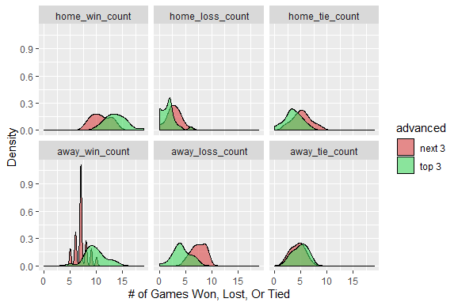

\newpage

# The Business Problems and Our Approaches

## Defining the Business Problem
Every season is defined in the mind of the fans by the prior performances and future expectations of the club. This inseparable truth shapes all facets of the club from personnel changes (coaching and players) to financial performance. Financial performance of the club can be impacted by attendance, merchandise, sponsorships, and broadcasting revenue for example. This is only complicated further by the UEFA tournament relegation and promotion system. Each league has space for a fixed number of teams. The bottom three teams in a league get relegated (demoted) to a lower league while the top three get promoted to a higher league. The ultimate goal is to get your club into the UEFA Champions League. The financial implication of being relegated or promoted the in tournament are substantial. According to an ESPN article, “The Cost of Premier League Relegation Enough to Make Clubs Panic”, repeated relegations place teams into deep debt burdens with the risk of bankruptcy (Brewin, 2017). Conversely, being promoted to the Champion’s League, the next league above Serie A, a club receives $37.13 million with the ability to make additional millions for each win and rank in the final outcomes of the UEFA Champions League tournament according to UEFA (UEFA, 2018).

With twenty teams in Serie A competing, A.S. Roma has been consistently in contention for promotion to the UEFA Champions League. As seen in Exhibit 1 below, four of the last eight seasons A.S. Roma has been promoted to the Champions League else the club has just missed the promotion cutoff of rank three or higher. Considering the financial gain both in terms of participation/performance bonuses and its increased core revenue (attendance, merchandise, sponsorships, and broadcasting) what can A.S. Roma do to maximize it’s chances to be ranked in the top three spots in the Serie A?

## Approach
In order to provide actionable insights for A.S. Roma and it’s coaches in what attributes define being a top three Serie A team opposed to a next three ranked (rank four, five, and six) we have tiered our inquiry. First, our analysis digs into the season level and looks for the key characteristics defining being a top three team opposed to the next three team. Despite the results being obvious, they give direction on what to focus on at the match level analysis. Second, we dig into the characteristics of specific matches as defined by the season level generalities to identify how the top three teams are different than the next three. In particular the focus will be on attributes of teams having success against competition which A.S. Roma should be capable of winning. These associations will serve as guidance for coaching to improve A.S. Roma’s probability of being a top three team opposed to a next three.


**Exhibit 1: A.S. Roma Rank by Season in the Serie A League**


\newpage

**Key-Question:**

What can A.S. Roma do to maximize it’s chances to be ranked in the top three in the Serie A League?

**Sub-Question(s):**

1. What characteristics are associated with being a top three team in Serie A opposed to a next
three team?
2. What characteristics at the team and player level are associated with beating teams away who
A.S. Roma is capable of beating? 


# Analysis on Team by Season Level

## Data Preparation
<!-- message=F doesn't show the running process, echo = F doesn't show the coding parts -->
**Load libraries**
```{r load_data, message = FALSE}
library("RSQLite") #to access data files in the sqllite dataframe.
library(tidyverse)
library(rvest)
library(xml2)
library(magrittr)
library(scales)
library(reshape2) # to melt columns into rows.
library(lubridate) # to convert text stored as dates into season dates.
library(arules) # necessary for running associations rules.
library(arulesViz) # visulize the association rules.
library(ggplot2)
library(ggsoccer)
library(kableExtra)
```

**Read Data**

As the data is found in a SQLite database, we have uploaded all tables and updated their 'id' fields to ensure primary keys and foreign keys are alike between tables.

```{r read_data, message = F}
#Set the work directory
#setwd('C:\\Users\\14tho\\OneDrive\\Documents\\UMN Graduate School\\Exploratory Analytics\\HW1')
#setwd('C:/Users/Piyush Gupta/Google Drive (gupta588@umn.edu)/MSBA 6410 - EDA/HW1')
setwd('/Users/xiangkchen/GoogleDrive/6410\ Exploratory\ Data\ Analytics/HOMEWORK/HW\ 1')


# Connect to the sqlite file.
sqlite <- dbDriver("SQLite")
euro_soccer_db <- dbConnect(sqlite,"euro_soccer.sqlite")

# Load the different data tables.
country <- data.frame(tbl(euro_soccer_db, "Country"))
league <- data.frame(tbl(euro_soccer_db, "League"))
match <- data.frame(tbl(euro_soccer_db, "Match"))
team <- data.frame(tbl(euro_soccer_db, "Team"))
team_attributes <- data.frame(tbl(euro_soccer_db, "Team_Attributes"))

# Reassign column 'id' names to be unique to and across tables.
colnames(match)[colnames(match)=="id"] <- "match_id"
colnames(league)[colnames(league)=="id"] <- "league_id"
colnames(country)[colnames(country)=="id"] <- "country_id"
colnames(team)[colnames(team)=="id"] <- "team_id"
colnames(team_attributes)[colnames(team_attributes)=="id"] <- "team_attributes_id"
```

**Overview of the Data**

In order to answer sub-question one "What characteristics are associated with being a top three team in Serie A opposed to a next three team?"", we must transform the available table to be grouped by season and team. This gives us the ability to analyze team characteristics, performance, and split the data into two groups: top three and next three teams by season.

We first analyzed the tables to establish what available features are pertinent in distinguishing top and next three teams in a league. Three tables are helpful in accomplishing our desired table: *team*, *team_attributes*, and *match*. 

Let's look at the general summary and comment on the available features for helping us answer sub-question one.

```{r summary_match, warning = FALSE}
# View first four variables to display general structure of data.
summary(match[1:4])
```

```{r summary_team, warning = FALSE}
summary(team[1:4])
```

```{r summary_team_attributes, warning = FALSE}
summary(team_attributes[1:4])
```

For purposes of reader digestibility, we have limited the output of these tables to four attributes. After skimming the data for each table, we noticed a few key takeaways. 

1. There is a limited number of missing data in either table. Where values are missing or NA it is inconsequential to grouping by the season and team level (ex. home or away player fields in the *match* table which are unnecessary for season/team level analysis). 
2.We have two important columns which are *home_team_goal* and *away_team_goal*. We can use these fields to calculate the number of wins/ties/losses and number of points per team per season. 
3.In order to run association rules outside of the teams records we can add team attributes which are conveniently already categorized or non-numeric (ex. *buildUpPlaySpeedClass* which categorizes teams as balanced, fast, or slow). 
4.We will need to convert the team record into category bins in order to use association rules.


## Data Transformation

### Team Level Data

**Merge Relevant Tables to Answer Sub-Question One:**

**What characteristics are associated with being a top three team in Serie A opposed to a next three team?**

Twenty teams play 32 games in a season, 16 home, 16 away respectively. We want to calculate how many points, wins, losses, and ties each team scores in a season.

In the *match* table, we have the *home_team_api_id* and *away_team_api_id*, but we add fields to the *team* table to indicate the team as home or away for clarity in future table joins. We merge the *match*, *country*, *league*, *team_home*, and *team_away* tables into one joint table which contains all 25,979 matches in the dataset.

```{r match team name}
# Create home and away team names in the team table.
team['home_team_name'] <- team['team_long_name']
team['away_team_name']<- team['team_long_name']

# Establish desired columns from each dataframe for a future JOIN.
match_labels <- c('match_id', 'country_id', 'league_id', 'season', 'match_api_id',
                  'home_team_api_id','away_team_api_id', 'home_team_goal', 'away_team_goal')
country_labels <- names(country)
league_labels <- names(league)
team_labels_home <- c('team_api_id','home_team_name')
team_labels_away <- c('team_api_id','away_team_name')

# Merge/Join tables together.
m_c_ <- merge(match[match_labels], country[country_labels], by='country_id')
m_c_l_ <- merge(m_c_, league[league_labels], by='league_id')
m_c_l_t_ <- merge(m_c_l_, team[team_labels_home], by.x='home_team_api_id', by.y='team_api_id')
m_c_l_t_ <- merge(m_c_l_t_, team[team_labels_away], by.x='away_team_api_id', by.y='team_api_id')
```

**Group Tables to Season and Team Level**

The data however is still not in a condition to be used in solving our sub-question one **“What characteristics are associated with being a top three team in Serie A opposed to a next three team?”**. We must create new columns which will be able to be grouped by season to display the team’s total wins, losses, and ties for both home and away games. In addition, we want to focus specifically on only the league which A.S. Roma competes in which is Serie A (league_id = 10257).

```{r match points}
# create new columns on full merged table for win/loss/tie counts per team and filter 
# to the Series A league.
ungrouped_soccer <- m_c_l_t_ %>% 
                  mutate(home_wins = if_else(home_team_goal > away_team_goal, 1, 0)) %>%
                  mutate(home_losses = if_else(home_team_goal < away_team_goal, 1, 0)) %>%
                  mutate(home_ties = if_else(home_team_goal == away_team_goal, 1, 0)) %>%
                  mutate(away_wins = if_else(home_team_goal < away_team_goal, 1, 0)) %>%
                  mutate(away_losses = if_else(home_team_goal > away_team_goal, 1, 0)) %>%
                  mutate(away_ties = if_else(home_team_goal == away_team_goal, 1, 0)) %>%
                  filter(league_id == 10257) # 10257 is Series A league

# Aggregate win/lose/tie games for home teams in the data. Group by team and season.
grouped_soccer_home <- ungrouped_soccer %>%
  group_by(home_team_api_id, season) %>%
  summarise(home_win_count = sum(home_wins),
  home_loss_count = sum(home_losses),
  home_tie_count = sum(home_ties),
  home_win_points = (sum(home_wins) * 3), # 3 points for every win
  home_loss_points = (sum(home_losses) * 0), # 0 points for every loss
  home_tie_points = (sum(home_ties) * 1)) # 1 point for every tie

# Aggregate win/lose/tie games for away teams in the data. Group by team and season.                 
grouped_soccer_away <- ungrouped_soccer %>%
  group_by(away_team_api_id, season) %>%
  summarise(away_win_count = sum(away_wins),
            away_loss_count = sum(away_losses),
            away_tie_count = sum(away_ties),
            away_win_points = (sum(away_wins) * 3), # 3 points for every win
            away_loss_points = (sum(away_losses) * 0), # 0 points for every loss
            away_tie_points = (sum(away_ties) * 1)) # 1 point for every tie

# Join the home and away team statistics.
grouped_joined_soccer <- inner_join(grouped_soccer_home, grouped_soccer_away,
                                    by=c('home_team_api_id' = 'away_team_api_id',
                                         'season' = 'season'))

# Add columns for total points and games played for each team by season.
grouped_joined_soccer <-  grouped_joined_soccer %>%
  mutate(total_points = (home_win_points + home_tie_points + away_win_points + 
                           away_tie_points)) %>%
  mutate(total_games = (home_win_count + home_loss_count + home_tie_count +
                          away_win_count + away_loss_count + away_tie_count))%>%
  arrange(desc(total_points)) %>%
  arrange(desc(season))


head(grouped_joined_soccer)
```

**Rank Teams for Each Season**

Our data is now grouped by team and season and has a total of 160 rows (20 teams for 8 seasons) and has total points for each team in a season. We must now rank each team in terms of points. This gives us the ability to limit our data set to those top six teams of interest and segment into the top three (rank 1, 2, 3) and next three (rank 4, 5, 6) teams. 

```{r team rank}
# Uniformly there are 20 teams per season. 
# Thus, add the team ranking for each team when arranged by total points and season descending.
grouped_joined_soccer['rank'] <- rep(c(1:20), 8)

# Filter data to just those ranked in the top 6 per season and add row identifying 
# teams in the top 3 or not
final_soccer <- grouped_joined_soccer %>%
  filter(rank %in% c(1:6)) %>%
  mutate(advanced = if_else(rank <= 3, 'top 3', 'next 3'))

head(final_soccer[c('home_team_api_id','season','total_points','advanced')])
```

**Convert Data to Transactional Level Data**

Now, we have information about teams wins/losses/ties, points and rank in our data. Lastly, we need to append the categorical variables from the *team_attributes* table which will be the last step in having transactional level data which to run association rules on.

The first hurdle is getting the primary key (team_id and season) to be found in both our *final_soccer* team/season grouped table and the *team_attributes* table.

```{r transaction,warning=F}
# Convert the team attributes 'Date' field to the season level.
teamatt <- team_attributes
teamatt['year'] <- year(teamatt$date)
teamatt['month'] <- month(teamatt$date)

date_vector <- ifelse(teamatt$year==2010,ifelse(teamatt$month>=9,'2010/2011','2009/2010'), 
ifelse(teamatt$year==2011,ifelse(teamatt$month>=9,'2011/2012','2010/2011'),
ifelse(teamatt$year==2012,ifelse(teamatt$month>=9,'2012/2013','2011/2012'),
ifelse(teamatt$year==2013,ifelse(teamatt$month>=9,'2013/2014','2012/2013'),
ifelse(teamatt$year==2014,ifelse(teamatt$month>=9,'2014/2015','2013/2014'),
ifelse(teamatt$year==2015,ifelse(teamatt$month>=9,'2015/2016','2014/2015'),'unknown'))))))

# Create a new table for team_attributes with the updated date to season field.
updated_team_attributes <- team_attributes
updated_team_attributes['date'] <- date_vector

# Join the final_soccer and team_attributes table.
transaction <- inner_join(final_soccer, updated_team_attributes,
                          by=c('home_team_api_id' = 'team_api_id',
                               'season' = 'date'))
```


### Transaction Level Data

We prepare for the final transactional table to be used in association rules by selecting those season/team level characteristics of interest: home and away wins/ties/losses and other team attributes like team dribbling and passing skills. However, we must convert the numeric fields to the categorical level. We chose to do min-max normalization for the top six teams and classify each team by season in the appropriate quartile for their position in the number of wins, losses, and ties.

```{r final_transaction, message=F, warning=F}
# Select only fields of interest.
transaction <- transaction %>%
  select(advanced, home_loss_count, home_win_count, home_tie_count,
         away_loss_count, away_win_count, away_tie_count,
         buildUpPlaySpeedClass, buildUpPlayDribblingClass,
         buildUpPlayPassingClass, buildUpPlayPositioningClass,
         chanceCreationPassingClass, chanceCreationCrossingClass,
         chanceCreationShootingClass, chanceCreationPositioningClass,
         defencePressureClass, defenceAggressionClass,
         defenceTeamWidthClass, defenceDefenderLineClass)

# Remove the automated added identify row home_team_api.
transaction <- transaction[2:ncol(transaction)]

# Convert win/loss/tie counts to categorical level variables.
binning_matrix <- transaction[2:7]

# Min-max scaling for the numeric home or away win/loss/tie fields.
for (col in c(1:ncol(binning_matrix))) {
  binning_matrix[col] <- 
    (binning_matrix[col] - 
       min(binning_matrix[col])) / (max(binning_matrix[col]) - min(binning_matrix[col]))
}

# Categorize the home or away win/loss/tie counts for each team by the min-max normalized value.
for (col in c(1:ncol(binning_matrix))) {
  binning_matrix[col] <- ifelse(binning_matrix[col] >= .75, '75-100_pct',
                                ifelse(binning_matrix[col] >= .5, '50-75_pct',
                                       ifelse(binning_matrix[col] >= .25, '25-50_pct',
                                              '0-25_pct')))
}

# Input the updated numeric to categorical fields into the final_transaction friendly dataframe.
final_transactions <- transaction
final_transactions[2:7] <- binning_matrix

# Convert the final_transactions table into a transaction data type.
final_transaction_data <- as (final_transactions, 'transactions')
```

The data is now in a transactional format and can be used to analyze our sub-question one of interest which is **“What characteristics are associated with being a top three team in Serie A opposed to a next three team?”**.

## General Analysis

Prior to running association rules to determine what team/season level characteristics seem to be associated with being in the top three teams in the Serie A league, you can notice in *Exhibit 2* the different distributions in wins, ties, and losses for top three teams versus next three teams for both home and away game. **The primary difference appears to be between a top three team and a next three team in their ability to win home games and not lose away games.**

**Exhibit 2**



To verify this assumption holds true we will run association rule testing to see what team/season level characteristics seem to be attributed with being a top three versus a next three team. In order to limit the number of rules and maintain high confidence the rules are indeed related to being a next three or top three team in the league. We set sufficient support, confidence, and lift parameters to limit the number of rules to those most substantiated in the data. The code is seen below.

```{r rules, warning=F, message = F, results = "hide"}
# Creation of rules for next three and top three in each season.
# created 4523 rules in total
rules_next <- apriori(final_transaction_data, parameter = list(supp = .35, conf = .50))
rules_top <- apriori(final_transaction_data, parameter = list(supp = .25, conf = .5))

# Subset rules with only 'next 3' being in the right hand side of the basket.
newrule_next <- subset(rules_next, rhs %pin% 'next 3' & lift >= 1.5)
# Subset rules with only 'top 3' being in the right hand side of the basket.
newrule_top <- subset(rules_top, rhs %pin% 'top 3' & lift >= 1.5)

# Visualize the associations. Code seen commented out below.
# plot(newrule_next, method='graph',engine='interactive', shading = 'lift')
# plot(newrule_top, method='graph', engine='interactive', shading = 'lift')
```

**General Findings and Conclusions for Sub-Question One**

**What characteristics are associated with being a top three team in Serie A opposed to a next three team?**

The associations as seen in *Exhibit 3* and *Exhibit 4* (see below) are association plots. The words and green circles represent a characteristic of a team at the season level, the brighter the red color indicates the stronger the lift (odds of the association over random chance) of the rule, and the size of the circles should be disregarded. 

* In *Exhibit 3*, association rules with being a next three team, you notice that teams having an away win record being in the bottom 25th percentile, an away loss record in the top 75th percentile, a medium defensive ability to pressure opponents, and a normal defense formation width are associated with being a next three team. 

* In *Exhibit 4*, association rules with being a top three team, you notice an association with being in the bottom 50th percentile in away losses, bottom 25th percentile in home losses, and a normal defense formation width are associated with being a top three team. However, some rules are not strong by themselves to define the difference between a top three and next three team. First, the defense team width being normal is the same for being both a top three and next three team therefore being irrelevant for distinguishing the two groups. Second, the defense pressure of “medium” as seen associating with a next three team does not have an opposite association to being a top three team. Meaning we would have expected the top three team to have a defense pressure class association different than a 'medium' ability. Thirdly, for the same reason as the second point the away win record of being in the bottom 25th percentile does not have an opposite analog for the top three teams. Therefore, the obvious association for distinguishing a top three and next three team is the team’s ability to not lose away games as next three teams are in the top 75th to 100th percentile in number of away losses while the top three teams are between the 25th to 50th percentile in number of away losses.

\newpage

**Exhibit 3: Association Rules with Being a Next Three Team (Ranks 4, 5, 6) in a Season**


**Exhibit 4: Association Rules with Being a Top Three Team (Ranks 1, 2, 3) in a Season**


\newpage

Now simply stating winning more away games is associated with being a top three team as opposed to a next three team in the Serie A league doesn't give assurance into how to achieve that feat. Winning those games are easier said than done. Especially considering the effect of home field advantage. According to the New York Times analysis on home field advantage in soccer which stated, "with 3 points for a win and 1 for a tie, teams garnered an average of 0.57 points more a game at home than on the road" (2008, Altiman). Therefore, we must find deeper associations about the teams and players who win on games on the road and avoid those away losses. Because each team plays one another twice (once at home and once away) we can see how teams A.S. Roma has lost to on the road but beat at home. Therefore, they are teams which A.S. Roma reasonably could have beat in that season and see the associations team and player characteristics of teams who were able to beat those teams at their home. With this analysis we will be able to answer our sub-question two "What characteristics at the team and player level are associated with beating teams away who A.S. Roma is capable of beating?". 


# Identifying Away Games that Can Be Won by AS Roma

Every team playing in the Serie-A is different in terms of player and team attributes. Because of this, every game that AS Roma plays in the league is different and different strategies must be employed to win a game against each of these 19 teams. 

When analyzing the average point difference of fringe teams (rank 4, 5, 6) in the Serie A League as seen in *Exhibit 5*, the average seasonal point difference from being placed in the top three team as opposed to a next three is 5.7 points from rank 4, 7.7 points from rank 5, and 11.4 points from rank 6. The difference is roughly three games worth a total of 9 points. So, where can A.S. Roma pickup three wins which are within their current capabilities?

**Exhibit 5: Average Points Scored per Season From Ranks 1 Through 6 in Serie A**
```{r}
# Visualize the average point difference betweena top 3 versus next 3 team
visual_data <- final_soccer[,c('rank', 'total_points')]
visual_data <- visual_data %>% group_by(rank) %>%
  summarise(avg_pts = mean(total_points))

visual <- ggplot(visual_data, aes(x=rank, y=avg_pts)) +
          geom_bar(stat='identity', col='#DA4545', fill='#DA4545')+
          geom_text(aes(label=round(avg_pts,0)), vjust=1.6, size=3.5, color='white') +
          scale_x_discrete(limits = c(1:6)) +
          ggtitle('Average Points Scored per Season From Ranks 1 Through 6 in Serie A') +
          ylab('Average Season Points') +
          xlab('Team Rank')
visual
```

```{r lost away matches}
# Create a new result column in match level data.
match$result <- ifelse(match$home_team_goal>match$away_team_goal,match$home_team_api_id,
                       ifelse(match$home_team_goal<match$away_team_goal,
                              match$away_team_api_id,"Tie"))

# Store As roma api id and name as variables.
team_name="Roma"
roma_api_id <- team[team$team_long_name==team_name,]$team_api_id

# AS Roma home and away matches from 2008-2016.
serie_a_matches <- match %>% filter(league_id == 10257)
home_matches <- match[match$home_team_api_id==roma_api_id,]
away_matches <- serie_a_matches[serie_a_matches$away_team_api_id==roma_api_id,]

# Calculate the away matches won, lost or tie by AS Roma.
away_matches$team_id <- away_matches$result
away_matches$result[away_matches$result==roma_api_id] <- "Win"
away_matches$result[!(away_matches$result =="Win" | away_matches$result=="Tie")] <- "Lost"
away_matches$team_id[(away_matches$result =="Tie")] <- roma_api_id
away_result <- away_matches %>% select(home_team_api_id,result) %>% 
  group_by(home_team_api_id) %>% summarize(away_win = sum(result == "Win"),
        away_loss = sum(result == "Lost"),away_tie = sum(result == "Tie"))
names(away_result)  <- c("teamId","awayWin", "awayLoss", "awayTie")

# Calculate the home matches won, lost or tie by AS Roma.
home_matches$team_id <- home_matches$result
home_matches$result[home_matches$result==roma_api_id] <- "Win"
home_matches$result[!(home_matches$result =="Win" | home_matches$result=="Tie")] <- "Lost"
home_result <- home_matches %>% select(away_team_api_id,result) %>% 
  group_by(away_team_api_id) %>% summarize(home_win = sum(result == "Win"), 
        home_loss = sum(result == "Lost"), home_tie = sum(result == "Tie"))
names(home_result)  <- c("teamId","homeWin", "homeLoss", "homeTie")

# Join the home and away team results for identifying teams against which 
# AS Roma has won most home games and lost high number of away games. 
home_away_result <- left_join(away_result,home_result, by="teamId")
team_name_matix_filter <- home_away_result[home_away_result$awayLoss>=4,]
team_name_matix_filter <- team_name_matix_filter[team_name_matix_filter$homeWin>=4,]

team_name_matix_filter <- team_name_matix_filter %>% select(teamId,awayWin, homeWin)
df <- gather(team_name_matix_filter, Game, Score, homeWin:awayWin)
names(df) <- c("team_api_id", "Game","Score")
df <- left_join(df,team,"team_api_id")
df$team_long_name <- as.factor(df$team_long_name)
df$Game <- as.factor(df$Game)
df <- with(df, df[order(team_long_name, -as.numeric(Game)), ])
```

We identified 3 teams against whom the odds of winning away games are the highest for AS Roma. To do this analysis we first identified the teams against whom AS Roma has won the least number of away games and the greatest number of home games.

The graph below exhibits our hypothesis. A.S. Roma wins the home games against Catania (Id #8530), Genoa (Id #9875), Napoli (Id #10233) but are incapable to win most of the away games against them. If A.S. Roma were able to win these away games, it would lead to 9-point jump assuming their performance remains constant on other dimensions. Hence, the odds of being qualified for the Champions League would rise greatly which is our ultimate goal.

**Exhibit 6: Number of Home Wins Vs. Away Wins Against Three Teams Which A.S. Could Have Beaten**
```{r}
ggplot(df, aes(x=team_long_name, y=Score, fill=Game))+
  geom_bar(position='dodge',stat='identity')+
  ylab('Number of Wins for AS Roma') +ggtitle('Serie A teams')+
  theme(plot.title = element_text(hjust=0.5))
```


\newpage

# Match/Team Level Away Game Analysis for A.S. Roma 

How can A.S. Roma win away games against Catania (Id #8530), Genoa (Id #9875), Napoli (Id #10233)? Below is an analysis on team/player attributes which are attributed to teams which have beaten these teams on their home turf and won. We have limited the characteristics of interest to player formations, team attributes, and types of goals as they commonly are attributed to the result of a game. First, the coach must strategically plan the formation on field and decide the kind of team attributes which work best against selected teams. Secondly, analysis of player attributes define the final team attributes for a particular match. Thirdly, the type of goal scored during a match is contingent upon the skillset of the players selected to play a match. Therefore our analysis focuses on associations of the above three dimensions (formation, team/player attributes, and types of goals) in order to beat Catania, Genoa, and Napoli on the road.


## Data Preparation

In order to prepare data for analysis, we performed 3 steps.

1. Filter the match level data for Napoli and select games where Napoli was playing in their home ground.
2. Derive match results (Win, Loss, Tie)
3. Combine team attributes with match level data.
4. Transform data to create team formations for each match.
5. Extract goal type information for every goal scored against Napoli.
6. Create three different data sets to run association rules.

The above mentioned steps were be replicated for Catania(8530), Genoa(9875) as well.

**Step 1: Filter the Match Level Data for Napoli and Select Games Where Napoli Was Playing in Their Home Ground **
```{r}
# Selecting match level data for Napoli
opponent_id <- 9875
opponent <- match[match$home_team_api_id == opponent_id,]
```

**Step 2: Derive Match Results (Win, Loss, Tie)**
```{r}
opponent$result[opponent$result==opponent_id] <- "Lost"
opponent$result[!(opponent$result =="Lost" | opponent$result=="Tie")] <- "Win"
```

**Step 3: Combine Team Attributes With Match Level Data**
```{r }
# Select team attributes for away team.
team_atts_cat <- team_attributes
col_name_team_att <- names(team_atts_cat)[5:25]
for (col in col_name_team_att){
  team_atts_cat[,col] <- paste(col,team_atts_cat[,col],sep="_")}

#Iterate over match data and select team attributes specific to that match.
opponent_team_attr <- data.frame()
for (i in 1:nrow(opponent)){
  opponent_row <- opponent[i,]
  team_atts_away <- team_atts_cat[team_atts_cat$team_api_id==
                                    opponent_row$away_team_api_id,]
  if (year(ymd_hms(opponent_row$date)) %in% year(ymd_hms(team_atts_away$date))){
    y1 <- year(ymd_hms(team_atts_away$date))
    y2 <- year(ymd_hms(opponent_row$date))
    team_atts_away <- team_atts_away[y1==y2,]
  } else{team_atts_away <- team_atts_away[1,]}
  team_atts_away <- team_atts_away[,grepl("Class",colnames(team_atts_cat))]
  opponent_row <- cbind(opponent_row,team_atts_away)
  
  if (nrow(opponent_team_attr)>0){
    opponent_team_attr <- rbind(opponent_team_attr,opponent_row)
  } else {
    opponent_team_attr <- opponent_row}
}
```

**Step 4: Transform Data to Create Team Formations For Each Match** 
```{r}
# Filter match level data.
match_dat_form <- opponent_team_attr[c(1,4,7,12:77)]
match_dat_form_clean <- match_dat_form

## Home team statistic consolidation.
match_dat_form_clean$hline1 <- rowSums(match_dat_form_clean[c(26:36)] == 1)
match_dat_form_clean$hline3 <- rowSums(match_dat_form_clean[c(26:36)] == 3)
match_dat_form_clean$hline5 <- rowSums(match_dat_form_clean[c(26:36)] == 5)
match_dat_form_clean$hline6 <- rowSums(match_dat_form_clean[c(26:36)] == 6)
match_dat_form_clean$hline7 <- rowSums(match_dat_form_clean[c(26:36)] == 7)
match_dat_form_clean$hline8 <- rowSums(match_dat_form_clean[c(26:36)] == 8)
match_dat_form_clean$hline9 <- rowSums(match_dat_form_clean[c(26:36)] == 9)
match_dat_form_clean$hline10 <- rowSums(match_dat_form_clean[c(26:36)] == 10)
match_dat_form_clean$hline11 <- rowSums(match_dat_form_clean[c(26:36)] == 11)
match_dat_form_clean$home_formation_r <- paste(match_dat_form_clean$hline2,
                    match_dat_form_clean$hline3,match_dat_form_clean$hline4,
                    match_dat_form_clean$hline5,match_dat_form_clean$hline6,
                    match_dat_form_clean$hline7,match_dat_form_clean$hline8,
                    match_dat_form_clean$hline9,match_dat_form_clean$hline10,
                                               match_dat_form_clean$hline11)
match_dat_form_clean$home_formation <- str_remove_all(
  match_dat_form_clean$home_formation_r,"[ 0]")

## Away team statistic consolidation.
match_dat_form_clean$aline1 <- rowSums(match_dat_form_clean[c(37:47)] == 1)
match_dat_form_clean$aline3 <- rowSums(match_dat_form_clean[c(37:47)] == 3)
match_dat_form_clean$aline5 <- rowSums(match_dat_form_clean[c(37:47)] == 5)
match_dat_form_clean$aline6 <- rowSums(match_dat_form_clean[c(37:47)] == 6)
match_dat_form_clean$aline7 <- rowSums(match_dat_form_clean[c(37:47)] == 7)
match_dat_form_clean$aline8 <- rowSums(match_dat_form_clean[c(37:47)] == 8)
match_dat_form_clean$aline9 <- rowSums(match_dat_form_clean[c(37:47)] == 9)
match_dat_form_clean$aline10 <- rowSums(match_dat_form_clean[c(37:47)] == 10)
match_dat_form_clean$aline11 <- rowSums(match_dat_form_clean[c(37:47)] == 11)
match_dat_form_clean$away_formation_r <- paste(match_dat_form_clean$aline2,
                    match_dat_form_clean$aline3,match_dat_form_clean$aline4,
                    match_dat_form_clean$aline5,match_dat_form_clean$aline6,
                    match_dat_form_clean$aline7,match_dat_form_clean$aline8,
                    match_dat_form_clean$aline9,match_dat_form_clean$aline10,
                                               match_dat_form_clean$aline11)
match_dat_form_clean$away_formation <- str_remove_all(
  match_dat_form_clean$away_formation_r, "[ 0]")

# Join with match table to filter data for association
opponent_team_attr <- match_dat_form_clean %>% left_join(opponent_team_attr,
                                                         by="match_id")
```

**Step 5: Extract Goal Type Information for Every Goal Scored Against Napoli**

```{r, warning = F}
# Code to extract goal level information.
opponent_team_attr$goal <- as.character(opponent_team_attr$goal)
for(counter in 1:length(opponent_team_attr)){
  away_team = opponent_team_attr$away_team_api_id[counter]
  if(is.na(away_team) == F & is.na(opponent_team_attr$goal[counter]) == F)
  { page_goal <- read_html(opponent_team_attr$goal[counter])
  teams = page_goal %>% html_nodes("team") %>% html_text()
  value_fields <- page_goal %>% html_nodes("value")
  value_count <- length(value_fields)
  teams <- page_goal %>% html_nodes("team") %>% html_text()
  goals <- page_goal %>% html_nodes("goals") %>% html_text()
  goal_count = 0
  goal_type <- page_goal %>% html_nodes("subtype") %>% html_text()
  goal_val = ""
  if(value_count > 0)
  {
    for(i in 1:value_count){
      if(is.na(teams[i]) == F & as.numeric(teams[i]) == as.numeric(away_team)){
        goal_count = goal_count + as.numeric(goals[i])
        if(length(goal_type) > 0){
          goal_val = paste(goal_val, goal_type[i], collapse = " ")
        }
      }
    }
  } 
  opponent_team_attr$away_goal_type[counter] <- goal_val
  opponent_team_attr$away_goal_count[counter] <- goal_count
  }
}
opponent_team_attr <- opponent_team_attr %>% 
  separate(away_goal_type,c("g0","g1","g2","g3","g4"),sep=" ")
opponent_team_attr$g0 <- NULL
opponent_team_attr[opponent_team_attr =="NA"] <- NA
```

**Step 6: Create Three Different Data Sets to Run Association Rules**
```{r}
# Creating final dataset to be used for association rules.
final_columns <- c("away_formation","result", col_name_team_att,"g1","g2","g3","g4")
opponent_final <- opponent_team_attr[,names(opponent_team_attr) %in% final_columns]
opponent_formation <- opponent_final[,1:2]
opponent_team_att <- opponent_final[,2:14]
opponent_goal <- opponent_final[,c(2,15:18)]
```

\newpage

## Analysis to Win Away Games Against Napoli (ID-9875)

To analyse how to win a game against Napoli, we looked at all the teams which have won games at Napoli's home.

### Team Attributes Analysis

Team attributes and player attributes can also be attributed towards a win or a loss. However, both attributes are highly correlated, that is, team attributes explain player attributes and vice-a-versa. We have therefore selected team attributes for our analysis. For this analysis, we have combined the data in the *team_attributes* table with the *match* table. The team attribute combination is different for every match since A.S. Roma can play any combination of 11 players from its selected roster. Our analysis presents the combination of attributes that A.S. Roma should possess in order to win away games against the Napoli. Team attributes are defined by speed, dribbling skills, passing, chances of passing and crossing that are utilized successfully, defense pressure and aggression. A combination of these skills in the team can help win a game. 

As seen in the below section "Visualization of Team Attributes" there are two combinations of team attributes which are associated with beating Napoli at their home. As mentioned in the Napoli section, the highlighted rows are attributes of a successful team attribute combination which are different than A.S. Roma's average set of team attributes.  Below are the suggested team attributes to emphasize when playing Napoli away:

* Success combination 1 calls states there is an association of an away team beating Catania when their combination of team attributes include shot play passing, normal passing creation, and medium defensive pressure. 
* Success combination 2 calls states there is an association of an away team beating Catania when their combination of team attributes include shot play passing, normal crossing creation, normal passing creation, and medium defensive pressure. 

We suggest taking a more comprehensive look into success combination 1 as it is like success combination 1 but without the need for emphasis on normal crossing creation. This would require overall less need for preparation and change come game day against Napoli what at their home.

```{r results="hide",warning = F}
win_team_att <- as(opponent_team_att, 'transactions')
# Creation of rules
rules <- apriori(win_team_att, parameter = list(supp = 0.04, conf = .01))
inspect(subset(rules, rhs %pin% 'Win' & lift >= 4))
win_team_attr <- subset(rules, rhs %pin% 'Win' & lift >= 4)
```

#### Visualization of Team Attributes

1. Create table for team attributes of AS Roma.
```{r}
#Create table for AS Roma attributes for 3 teams
team_atts_cat <- team_attributes
col_name_team_att <- names(team_atts_cat)[5:25]
for (col in col_name_team_att){
  team_atts_cat[,col] <- paste(col,team_atts_cat[,col],sep="_")
}
colnames_cat <- c("team_api_id","date",
                  names(team_atts_cat)[grepl("Class",
                          colnames(team_atts_cat))])
team_atts_cat <- team_atts_cat[,colnames_cat]
# Create data frame using attributes of AS ROMA team
roma_atts <- team_atts_cat[team_atts_cat$team_api_id==8686,]
roma_atts <- tail(roma_atts,1)
roma_atts <- unlist(roma_atts[1,3:14])
roma_atts_1 <- unlist(strsplit(roma_atts,split="_"))
roma_atts <- roma_atts_1[seq(2,24,2)]
atts_name <- roma_atts_1[seq(1,24,2)]
names(roma_atts) <- NULL
names(atts_name) <- NULL
graph_data <- matrix(0,nrow=12,ncol=2)
graph_data <- data.frame(graph_data)
graph_data[,1] <- atts_name
graph_data[,2] <- roma_atts
```

2. Create table for team attributes required to win against Napoli.
```{r, results="hide", warning = F}
rule_df <- data.frame(DATAFRAME(win_team_attr))
rule_df <- as.character(rule_df$LHS)

for (i in 1:length(rule_df)){
  win_att <- substr(rule_df[i],2,nchar(rule_df[i])-1)
  att_vec <- unlist(strsplit(win_att,split = ","))
  att_vec <- unlist(strsplit(att_vec,split="="))
  att_vec <- att_vec[seq(2,length(att_vec),2)]
  att_vec <- unlist(strsplit(att_vec,split="_"))
  win_atts <- att_vec[seq(2,length(att_vec),2)]
  win_atts_name <- att_vec[seq(1,length(att_vec),2)]
  win_atts_df <- cbind(win_atts_name,win_atts)
  graph_data <- merge(graph_data,win_atts_df,
                      by.x="X1",by.y="win_atts_name",all.x=T)
}
graph_data <- data.frame(graph_data,stringsAsFactors = F)
colnames(graph_data) <- c("Team_Attributes","AS_ROMA_Current_Attributes",
                          "Success_Combo_1","Success_Combo_2")
graph_data$Success_Combo_1 <- as.character(graph_data$Success_Combo_1)
graph_data$Success_Combo_2 <- as.character(graph_data$Success_Combo_2)
graph_data[is.na(graph_data)] <- "X"
```

3. Compare winning team attributes with AS Roma.
```{r}
graph_data %>%
  kable() %>% 
  kable_styling(bootstrap_options = c("striped","hover","condensed","responsive")) %>%
  row_spec(2, color = "black", background = "#add8e6") %>%
  row_spec(6, color = "black", background = "#add8e6")
```


### Goal Type Analysis

There are 12 different types of goals that can be scored in soccer. These goal types depend on the kind of “chances” that are available. These chances are determined by the kind of game which is being played, defensive or aggressive and the defense line up of the opposing team. We analyzed the games being played against the Napoli to better understand what kind of strategies could work against them. Opportunities for free-kick, headers, long range, volley if available should be seized and attempted.

As seen below winning games at Napoli's home significantly over random chance is associated with taking 'header' and 'shot' type goals. 

```{r results="hide", warning = F}
goal <- as (opponent_goal, 'transactions')

# Creation of rules.
rules <- apriori(goal, parameter = list(supp = 0.01, conf = .01))

#inspect(subset(rules, rhs %pin% 'Win' & lift >= 2))
win_goal <- subset(rules, rhs %pin% 'Win' & lift >= 2)
plot(win_goal,method="graph",shading=NA)
```


### Team Formation Analysis

In soccer, team formations are announced before the game and these formations are a large part of the strategy implemented for winning the game. Formations basically specify how the players are positioned on the field. The coach has a pool of formations to choose from for every game. Each game is different, and the formation is decided based on the opponent, the attributes of players playing the game and many other nuances. Different formations can be decided based on whether a team wants to play more attacking or defensive football. These formations can also be used to address the deficit or strength of players. Identifying which team formations work well against specific teams can help win a game.

Teams who have won against Napoli at their home have had a starting game formation of the 4-5-1 which is seen below in the "Visualizing The Winning Team Formation Over Napoli (4-5-1)" section. Particularly, this formation emphasizes defensive posturing. This conservative approach has had success in the past from other team in beating Napoli at their home. 

```{r results="hide", warning = F}
win_formation <- as (opponent_formation, 'transactions')
# Creation of rules.
rules <- apriori(win_formation, parameter = list(supp = 0.01, conf = .01))

#inspect(subset(rules, rhs %pin% 'Win' & lift >= 2))
win_formation <- subset(rules, rhs %pin% 'Win' & lift >= 2)
```

#### Visualizing The Winning Team Formation Over Napoli (4-5-1)
```{r, warning = F}
pitch_custom <- list(length = 150, width = 100, penalty_box_length = 25,
                     penalty_box_width = 50, six_yard_box_length = 8,
                     six_yard_box_width = 26, penalty_spot_distance = 16,
                     goal_width = 12, origin_x = 0, origin_y = 0)
shots <- data.frame(x = c(2,30,30,30,30,50,50,50,50,50,80),
                    y = c(50,80,60,40,20,95,70,51,35,10,50))

ggplot(shots) +
  annotate_pitch(colour = "white",fill   = "chartreuse4",limits = FALSE) +
  geom_point(aes(x = x, y = 100 - y),colour = "yellow",size = 8) +
  theme_pitch() +
  theme(plot.background = element_rect(fill = "chartreuse4"),
        title = element_text(colour = "white")) +
  ggtitle("Winning Formation Against Napoli")
```


```{r echo = FALSE, warning= F}
# Selecting match level data for Catania
opponent_id <- 8530
opponent <- match[match$home_team_api_id == opponent_id,]
```

```{r echo=FALSE, warning= F}
opponent$result[opponent$result==opponent_id] <- "Lost"
opponent$result[!(opponent$result =="Lost" | opponent$result=="Tie")] <- "Win"
```

```{r echo=FALSE, warning= F}
# Select team attributes for away team
team_atts_cat <- team_attributes
col_name_team_att <- names(team_atts_cat)[5:25]
for (col in col_name_team_att){
team_atts_cat[,col] <- paste(col,team_atts_cat[,col],sep="_")}
#Iterate over match data and select team attributes specific to that match
opponent_team_attr <- data.frame()
for (i in 1:nrow(opponent)){
opponent_row <- opponent[i,]
team_atts_away <- team_atts_cat[team_atts_cat$team_api_id==
opponent_row$away_team_api_id,]
if (year(ymd_hms(opponent_row$date)) %in% year(ymd_hms(team_atts_away$date))){
y1 <- year(ymd_hms(team_atts_away$date))
y2 <- year(ymd_hms(opponent_row$date))
team_atts_away <- team_atts_away[y1==y2,]
} else{team_atts_away <- team_atts_away[1,]}
team_atts_away <- team_atts_away[,grepl("Class",colnames(team_atts_cat))]
opponent_row <- cbind(opponent_row,team_atts_away)
if (nrow(opponent_team_attr)>0){
  opponent_team_attr <- rbind(opponent_team_attr,opponent_row)
} else {
opponent_team_attr <- opponent_row}
}
```

```{r echo=FALSE, warning= F}
# Filter match level data
match_dat_form <- opponent_team_attr[c(1,4,7,12:77)]
match_dat_form_clean <- match_dat_form
## Home team
match_dat_form_clean$hline1 <- rowSums(match_dat_form_clean[c(26:36)] == 1)
match_dat_form_clean$hline3 <- rowSums(match_dat_form_clean[c(26:36)] == 3)
match_dat_form_clean$hline5 <- rowSums(match_dat_form_clean[c(26:36)] == 5)
match_dat_form_clean$hline6 <- rowSums(match_dat_form_clean[c(26:36)] == 6)
match_dat_form_clean$hline7 <- rowSums(match_dat_form_clean[c(26:36)] == 7)
match_dat_form_clean$hline8 <- rowSums(match_dat_form_clean[c(26:36)] == 8)
match_dat_form_clean$hline9 <- rowSums(match_dat_form_clean[c(26:36)] == 9)
match_dat_form_clean$hline10 <- rowSums(match_dat_form_clean[c(26:36)] == 10)
match_dat_form_clean$hline11 <- rowSums(match_dat_form_clean[c(26:36)] == 11)
match_dat_form_clean$home_formation_r <- paste(match_dat_form_clean$hline2,
match_dat_form_clean$hline3,match_dat_form_clean$hline4,
match_dat_form_clean$hline5,match_dat_form_clean$hline6,
match_dat_form_clean$hline7,match_dat_form_clean$hline8,
match_dat_form_clean$hline9,match_dat_form_clean$hline10,
match_dat_form_clean$hline11)
match_dat_form_clean$home_formation <- str_remove_all(match_dat_form_clean$home_formation_r,"[ 0]")
## Away team
match_dat_form_clean$aline1 <- rowSums(match_dat_form_clean[c(37:47)] == 1)
match_dat_form_clean$aline3 <- rowSums(match_dat_form_clean[c(37:47)] == 3)
match_dat_form_clean$aline5 <- rowSums(match_dat_form_clean[c(37:47)] == 5)
match_dat_form_clean$aline6 <- rowSums(match_dat_form_clean[c(37:47)] == 6)
match_dat_form_clean$aline7 <- rowSums(match_dat_form_clean[c(37:47)] == 7)
match_dat_form_clean$aline8 <- rowSums(match_dat_form_clean[c(37:47)] == 8)
match_dat_form_clean$aline9 <- rowSums(match_dat_form_clean[c(37:47)] == 9)
match_dat_form_clean$aline10 <- rowSums(match_dat_form_clean[c(37:47)] == 10)
match_dat_form_clean$aline11 <- rowSums(match_dat_form_clean[c(37:47)] == 11)
match_dat_form_clean$away_formation_r <- paste(match_dat_form_clean$aline2,
match_dat_form_clean$aline3,match_dat_form_clean$aline4,
match_dat_form_clean$aline5,match_dat_form_clean$aline6,
match_dat_form_clean$aline7,match_dat_form_clean$aline8,
match_dat_form_clean$aline9,match_dat_form_clean$aline10,
match_dat_form_clean$aline11)
match_dat_form_clean$away_formation <- str_remove_all(
match_dat_form_clean$away_formation_r, "[ 0]")
# Join with match table to filter data for association
opponent_team_attr <- match_dat_form_clean %>% left_join(opponent_team_attr,
by="match_id")
```

```{r echo=FALSE, warning= F}
# Code to extract goal level information
opponent_team_attr$goal <- as.character(opponent_team_attr$goal)
for(counter in 1:length(opponent_team_attr)){
away_team = opponent_team_attr$away_team_api_id[counter]
if(is.na(away_team) == F & is.na(opponent_team_attr$goal[counter]) == F)
{ page_goal <- read_html(opponent_team_attr$goal[counter])
teams = page_goal %>% html_nodes("team") %>% html_text()
value_fields <- page_goal %>% html_nodes("value")
value_count <- length(value_fields)
teams <- page_goal %>% html_nodes("team") %>% html_text()
goals <- page_goal %>% html_nodes("goals") %>% html_text()
goal_count = 0
goal_type <- page_goal %>% html_nodes("subtype") %>% html_text()
goal_val = ""
if(value_count > 0)
{
for(i in 1:value_count){
if(is.na(teams[i]) == F & as.numeric(teams[i]) == as.numeric(away_team)){
goal_count = goal_count + as.numeric(goals[i])
if(length(goal_type) > 0){
goal_val = paste(goal_val, goal_type[i], collapse = " ")
}
}
}
}
opponent_team_attr$away_goal_type[counter] <- goal_val
opponent_team_attr$away_goal_count[counter] <- goal_count
}
}
opponent_team_attr <- opponent_team_attr %>%
separate(away_goal_type,c("g0","g1","g2","g3","g4"),sep=" ")
opponent_team_attr$g0 <- NULL
opponent_team_attr[opponent_team_attr =="NA"] <- NA
```

```{r echo=FALSE, warning= F}
#Creating final dataset to be used for association rules
final_columns <- c("away_formation","result", col_name_team_att,"g1","g2","g3","g4")
opponent_final <- opponent_team_attr[,names(opponent_team_attr) %in% final_columns]
opponent_formation <- opponent_final[,1:2]
opponent_team_att <- opponent_final[,2:14]
opponent_goal <- opponent_final[,c(2,15:18)]
```

\newpage

## Analysis to Win Away Games Against Catania (ID-8530)

To analyze how to win a game against Catania, we looked at all the teams which have won away matches against them. We followed the same procedures as illustrated with in the analysis for Napoli. 

### Team Attributes Analysis

As seen in the below section "Visualization of Team Attributes to Beat Catania When Playing Away" there are two combinations of team attributes which are associated with beating Catania at their home. As mentioned in the Napoli section, the highlighted rows are attributes of a successful team attribute combination which are different than A.S. Roma's average set of team attributes.  Below are the suggested team attributes to emphasize when playing Catania away:

* Success combination 1 calls states there is an association of an away team beating Catania when their combination of team attributes include little dribbling, a free form play/positioning, a balanced play speed, a normal crossing creation, a normal pass creation, frequent shooting, and a pressing amount of defensive aggression. 

* Success combination 2 calls states there is an association of an away team beating Catania when their combination of team attributes include little dribbling, a balanced play speed, a normal crossing creation, a normal pass creation, a free form positioning style, a pressing amount of defensive aggression, and an offside trap defensive line. 

We suggest taking a more comprehensive look into success combination 2 as it has the least number of team attribute differences from the average attributes of A.S. Roma.


```{r results="hide", echo = F, warning = F}
win_team_att <- as(opponent_team_att, 'transactions')
# Creation of rules
rules <- apriori(win_team_att, parameter = list(supp = 0.04, conf = .7))
#inspect(subset(rules, rhs %pin% 'Win' & lift >= 2.7))
win_team_attr <- subset(rules, rhs %pin% 'Win' & lift >= 2.7)[44:45,]
```

#### Visualization of Team Attributes

```{r echo = F, warning= F}
#Create table for AS Roma attributes for 3 teams
team_atts_cat <- team_attributes
col_name_team_att <- names(team_atts_cat)[5:25]
for (col in col_name_team_att){
  team_atts_cat[,col] <- paste(col,team_atts_cat[,col],sep="_")
}
colnames_cat <- c("team_api_id","date",
                  names(team_atts_cat)[grepl("Class",
                          colnames(team_atts_cat))])
team_atts_cat <- team_atts_cat[,colnames_cat]
# Create data frame using attributes of AS ROMA team
roma_atts <- team_atts_cat[team_atts_cat$team_api_id==8686,]
roma_atts <- tail(roma_atts,1)
roma_atts <- unlist(roma_atts[1,3:14])
roma_atts_1 <- unlist(strsplit(roma_atts,split="_"))
roma_atts <- roma_atts_1[seq(2,24,2)]
atts_name <- roma_atts_1[seq(1,24,2)]
names(roma_atts) <- NULL
names(atts_name) <- NULL
graph_data <- matrix(0,nrow=12,ncol=2)
graph_data <- data.frame(graph_data)
graph_data[,1] <- atts_name
graph_data[,2] <- roma_atts
```

```{r, results="hide", echo=F}
rule_df <- data.frame(DATAFRAME(win_team_attr))
rule_df <- as.character(rule_df$LHS)

for (i in 1:length(rule_df)){
  win_att <- substr(rule_df[i],2,nchar(rule_df[i])-1)
  att_vec <- unlist(strsplit(win_att,split = ","))
  att_vec <- unlist(strsplit(att_vec,split="="))
  att_vec <- att_vec[seq(2,length(att_vec),2)]
  att_vec <- unlist(strsplit(att_vec,split="_"))
  win_atts <- att_vec[seq(2,length(att_vec),2)]
  win_atts_name <- att_vec[seq(1,length(att_vec),2)]
  win_atts_df <- cbind(win_atts_name,win_atts)
  graph_data <- merge(graph_data,win_atts_df,
                      by.x="X1",by.y="win_atts_name",all.x=T)
}
graph_data <- data.frame(graph_data,stringsAsFactors = F)
colnames(graph_data) <- c("Team_Attributes","AS_ROMA_Current_Attributes",
                          "Success_Combo_1","Success_Combo_2")
graph_data$Success_Combo_1 <- as.character(graph_data$Success_Combo_1)
graph_data$Success_Combo_2 <- as.character(graph_data$Success_Combo_2)
graph_data[is.na(graph_data)] <- "X"
```

```{r}
graph_data %>%
  kable() %>% 
  kable_styling(bootstrap_options = c("striped","hover","condensed","responsive")) %>%
  row_spec(3, color = "black", background = "#add8e6") %>%
  row_spec(4, color = "black", background = "#add8e6") %>%
  row_spec(6, color = "black", background = "#add8e6") %>%
  row_spec(8, color = "black", background = "#add8e6") %>%
  row_spec(10, color = "black", background = "#add8e6")
```

### Goal Type Analysis
```{r results="hide", echo = F, warning= F}
goal <- as (opponent_goal, 'transactions')

# Creation of rules
rules <- apriori(goal, parameter = list(supp = 0.01, conf = .01))

#inspect(subset(rules, rhs %pin% 'Win' & lift >= 2))
win_goal <- subset(rules, rhs %pin% 'Win' & lift >= 2)
```

```{r, warning= F}
plot(win_goal,method="graph",shading=NA)
```

In addition to adjustments to the average team attributes emphasized during away Catania games, there is an association of teams who beat Catania at their home by taking 'shot' type goals.

### Team Formation Analysis

Contrarily to to Napoli, winning games against Catania is associated with a more aggresive offensive play formation. Teams who have beat Catnia at their home have an association of taking the (4-3-2-1) formation. You notice three strikers are more forward in formation towards Catania's goal. 

```{r results="hide", warning= F}
win_formation <- as (opponent_formation, 'transactions')
# Creation of rules
rules <- apriori(win_formation, parameter = list(supp = 0.01, conf = .01))

#inspect(subset(rules, rhs %pin% 'Win' & lift >= 2))
win_formation <- subset(rules, rhs %pin% 'Win' & lift >= 2)
```

#### Visualizing Winning Team Formation 4-3-2-1
```{r, warning= F}
pitch_custom <- list(length = 150, width = 100, penalty_box_length = 25,
                     penalty_box_width = 50, six_yard_box_length = 8,
                     six_yard_box_width = 26, penalty_spot_distance = 16,
                     goal_width = 12, origin_x = 0, origin_y = 0)
shots <- data.frame(x = c(2,30,30,30,30,50,50,50,70,70,80),
                    y = c(50,80,60,40,20,85,50,20,65,35,50))

ggplot(shots) +
  annotate_pitch(colour = "white",fill   = "chartreuse4",limits = FALSE) +
  geom_point(aes(x = x, y = 100 - y),colour = "yellow",size = 8) +
  theme_pitch() +
  theme(plot.background = element_rect(fill = "chartreuse4"),
        title = element_text(colour = "white")) +
  ggtitle("Winning Formation Against Catania")
```


```{r echo = FALSE, warning= F}
# Selecting match level data for Genoa
opponent_id <- 10233
opponent <- match[match$home_team_api_id == opponent_id,]
```

```{r echo=FALSE, warning= F}
opponent$result[opponent$result==opponent_id] <- "Lost"
opponent$result[!(opponent$result =="Lost" | opponent$result=="Tie")] <- "Win"
```

```{r echo=FALSE, warning= F}
# Select team attributes for away team
team_atts_cat <- team_attributes
col_name_team_att <- names(team_atts_cat)[5:25]
for (col in col_name_team_att){
team_atts_cat[,col] <- paste(col,team_atts_cat[,col],sep="_")}
#Iterate over match data and select team attributes specific to that match
opponent_team_attr <- data.frame()
for (i in 1:nrow(opponent)){
opponent_row <- opponent[i,]
team_atts_away <- team_atts_cat[team_atts_cat$team_api_id==
opponent_row$away_team_api_id,]
if (year(ymd_hms(opponent_row$date)) %in% year(ymd_hms(team_atts_away$date))){
y1 <- year(ymd_hms(team_atts_away$date))
y2 <- year(ymd_hms(opponent_row$date))
team_atts_away <- team_atts_away[y1==y2,]
} else{team_atts_away <- team_atts_away[1,]}
team_atts_away <- team_atts_away[,grepl("Class",colnames(team_atts_cat))]
opponent_row <- cbind(opponent_row,team_atts_away)
if (nrow(opponent_team_attr)>0){
  opponent_team_attr <- rbind(opponent_team_attr,opponent_row)
} else {
opponent_team_attr <- opponent_row}
}
```

```{r echo=FALSE, warning= F}
# Filter match level data
match_dat_form <- opponent_team_attr[c(1,4,7,12:77)]
match_dat_form_clean <- match_dat_form
## Home team
match_dat_form_clean$hline1 <- rowSums(match_dat_form_clean[c(26:36)] == 1)
match_dat_form_clean$hline3 <- rowSums(match_dat_form_clean[c(26:36)] == 3)
match_dat_form_clean$hline5 <- rowSums(match_dat_form_clean[c(26:36)] == 5)
match_dat_form_clean$hline6 <- rowSums(match_dat_form_clean[c(26:36)] == 6)
match_dat_form_clean$hline7 <- rowSums(match_dat_form_clean[c(26:36)] == 7)
match_dat_form_clean$hline8 <- rowSums(match_dat_form_clean[c(26:36)] == 8)
match_dat_form_clean$hline9 <- rowSums(match_dat_form_clean[c(26:36)] == 9)
match_dat_form_clean$hline10 <- rowSums(match_dat_form_clean[c(26:36)] == 10)
match_dat_form_clean$hline11 <- rowSums(match_dat_form_clean[c(26:36)] == 11)
match_dat_form_clean$home_formation_r <- paste(match_dat_form_clean$hline2,
match_dat_form_clean$hline3,match_dat_form_clean$hline4,
match_dat_form_clean$hline5,match_dat_form_clean$hline6,
match_dat_form_clean$hline7,match_dat_form_clean$hline8,
match_dat_form_clean$hline9,match_dat_form_clean$hline10,
match_dat_form_clean$hline11)
match_dat_form_clean$home_formation <- str_remove_all(match_dat_form_clean$home_formation_r,"[ 0]")
## Away team
match_dat_form_clean$aline1 <- rowSums(match_dat_form_clean[c(37:47)] == 1)
match_dat_form_clean$aline3 <- rowSums(match_dat_form_clean[c(37:47)] == 3)
match_dat_form_clean$aline5 <- rowSums(match_dat_form_clean[c(37:47)] == 5)
match_dat_form_clean$aline6 <- rowSums(match_dat_form_clean[c(37:47)] == 6)
match_dat_form_clean$aline7 <- rowSums(match_dat_form_clean[c(37:47)] == 7)
match_dat_form_clean$aline8 <- rowSums(match_dat_form_clean[c(37:47)] == 8)
match_dat_form_clean$aline9 <- rowSums(match_dat_form_clean[c(37:47)] == 9)
match_dat_form_clean$aline10 <- rowSums(match_dat_form_clean[c(37:47)] == 10)
match_dat_form_clean$aline11 <- rowSums(match_dat_form_clean[c(37:47)] == 11)
match_dat_form_clean$away_formation_r <- paste(match_dat_form_clean$aline2,
match_dat_form_clean$aline3,match_dat_form_clean$aline4,
match_dat_form_clean$aline5,match_dat_form_clean$aline6,
match_dat_form_clean$aline7,match_dat_form_clean$aline8,
match_dat_form_clean$aline9,match_dat_form_clean$aline10,
match_dat_form_clean$aline11)
match_dat_form_clean$away_formation <- str_remove_all(
match_dat_form_clean$away_formation_r, "[ 0]")
# Join with match table to filter data for association
opponent_team_attr <- match_dat_form_clean %>% left_join(opponent_team_attr,
by="match_id")
```

```{r echo=FALSE}
# Code to extract goal level information
opponent_team_attr$goal <- as.character(opponent_team_attr$goal)
for(counter in 1:length(opponent_team_attr)){
away_team = opponent_team_attr$away_team_api_id[counter]
if(is.na(away_team) == F & is.na(opponent_team_attr$goal[counter]) == F)
{ page_goal <- read_html(opponent_team_attr$goal[counter])
teams = page_goal %>% html_nodes("team") %>% html_text()
value_fields <- page_goal %>% html_nodes("value")
value_count <- length(value_fields)
teams <- page_goal %>% html_nodes("team") %>% html_text()
goals <- page_goal %>% html_nodes("goals") %>% html_text()
goal_count = 0
goal_type <- page_goal %>% html_nodes("subtype") %>% html_text()
goal_val = ""
if(value_count > 0)
{
for(i in 1:value_count){
if(is.na(teams[i]) == F & as.numeric(teams[i]) == as.numeric(away_team)){
goal_count = goal_count + as.numeric(goals[i])
if(length(goal_type) > 0){
goal_val = paste(goal_val, goal_type[i], collapse = " ")
}
}
}
}
opponent_team_attr$away_goal_type[counter] <- goal_val
opponent_team_attr$away_goal_count[counter] <- goal_count
}
}
opponent_team_attr <- opponent_team_attr %>%
separate(away_goal_type,c("g0","g1","g2","g3","g4"),sep=" ")
opponent_team_attr$g0 <- NULL
opponent_team_attr[opponent_team_attr =="NA"] <- NA
```

```{r echo=FALSE}
#Creating final dataset to be used for association rules
final_columns <- c("away_formation","result", col_name_team_att,"g1","g2","g3","g4")
opponent_final <- opponent_team_attr[,names(opponent_team_attr) %in% final_columns]
opponent_formation <- opponent_final[,1:2]
opponent_team_att <- opponent_final[,2:14]
opponent_goal <- opponent_final[,c(2,15:18)]
```


## Analysis to Win Away Games Against Genoa (ID-10233)

To analyse how to win a game against Genoa, we looked at all the teams which have won away matches against them.


### Team Attributes Analysis

Success combination 1 calls states there is an association of an away team beating Genoa when their combination of team attributes include a balanced play speed, a normal pass creation, a free form position creation, pressing amount of defensive aggression, and an offside trap defensive line. 

Success combination 2 calls states there is an association of an away team beating Genoa when their combination of team attributes include a normal pass creation, a free form position creation, pressing amount of defensive aggression, and an offside trap defensive line. 

We suggest taking a more comprehensive look into success combination 2 as it has one less association rule to the set. Thus, you would not need to focus on a change in teams play speed when playing Genoa on the road.

```{r results="hide", echo = F, warning= F}
win_team_att <- as(opponent_team_att, 'transactions')
# Creation of rules
rules <- apriori(win_team_att, parameter = list(supp = 0.04, conf = .01))
#inspect(subset(rules, rhs %pin% 'Win' & lift >= 2.5))
win_team_attr <- subset(rules, rhs %pin% 'Win' & lift >= 2.5)[29:30,]
```

#### Visualization for Team Attributes

```{r echo = F, warning= F}
#Create table for AS Roma attributes for 3 teams
team_atts_cat <- team_attributes
col_name_team_att <- names(team_atts_cat)[5:25]
for (col in col_name_team_att){
  team_atts_cat[,col] <- paste(col,team_atts_cat[,col],sep="_")
}
colnames_cat <- c("team_api_id","date",
                  names(team_atts_cat)[grepl("Class",
                          colnames(team_atts_cat))])
team_atts_cat <- team_atts_cat[,colnames_cat]
# Create data frame using attributes of AS ROMA team
roma_atts <- team_atts_cat[team_atts_cat$team_api_id==8686,]
roma_atts <- tail(roma_atts,1)
roma_atts <- unlist(roma_atts[1,3:14])
roma_atts_1 <- unlist(strsplit(roma_atts,split="_"))
roma_atts <- roma_atts_1[seq(2,24,2)]
atts_name <- roma_atts_1[seq(1,24,2)]
names(roma_atts) <- NULL
names(atts_name) <- NULL
graph_data <- matrix(0,nrow=12,ncol=2)
graph_data <- data.frame(graph_data)
graph_data[,1] <- atts_name
graph_data[,2] <- roma_atts
```

```{r, results="hide", echo=F, warning= F}
rule_df <- data.frame(DATAFRAME(win_team_attr))
rule_df <- as.character(rule_df$LHS)

for (i in 1:length(rule_df)){
  win_att <- substr(rule_df[i],2,nchar(rule_df[i])-1)
  att_vec <- unlist(strsplit(win_att,split = ","))
  att_vec <- unlist(strsplit(att_vec,split="="))
  att_vec <- att_vec[seq(2,length(att_vec),2)]
  att_vec <- unlist(strsplit(att_vec,split="_"))
  win_atts <- att_vec[seq(2,length(att_vec),2)]
  win_atts_name <- att_vec[seq(1,length(att_vec),2)]
  win_atts_df <- cbind(win_atts_name,win_atts)
  graph_data <- merge(graph_data,win_atts_df,
                      by.x="X1",by.y="win_atts_name",all.x=T)
}
graph_data <- data.frame(graph_data,stringsAsFactors = F)
colnames(graph_data) <- c("Team_Attributes","AS_ROMA_Current_Attributes",
                          "Success_Combo_1","Success_Combo_2")
graph_data$Success_Combo_1 <- as.character(graph_data$Success_Combo_1)
graph_data$Success_Combo_2 <- as.character(graph_data$Success_Combo_2)
graph_data[is.na(graph_data)] <- "X"
```

```{r, warning= F}
graph_data %>%
  kable() %>% 
  kable_styling(bootstrap_options = c("striped","hover","condensed","responsive")) %>%
  row_spec(4, color = "black", background = "#add8e6") %>%
  row_spec(6, color = "black", background = "#add8e6") %>%
  row_spec(10, color = "black", background = "#add8e6")
```


### Goal Type Analysis
```{r results="hide", warning= F}
goal <- as (opponent_goal, 'transactions')

# Creation of rules
rules <- apriori(goal, parameter = list(supp = 0.01, conf = .01))

#inspect(subset(rules, rhs %pin% 'Win' & lift >= 2))
win_goal <- subset(rules, rhs %pin% 'Win' & lift >= 2)
```

```{r, warning= F}
plot(win_goal,method="graph",shading=NA)
```
In addition to implementing strategies with the possible two successfull combinations of team attributes against Genoa, A.S. Roma can focus on taking 'volley' and 'shot' type goals.

### Team Formation Analysis

Teams who have won against Genoa at their home have had a formation with a heavy emphasis on a more an offensive focus with five players focuses on Genoea's half of the field. The emphasis of the formation is one strong coverage and high offensive opportunities. The formation (4-1-2-1-2) used with success against Genoa can be seen below.

```{r results="hide", warning= F}
win_formation <- as (opponent_formation, 'transactions')
# Creation of rules
rules <- apriori(win_formation, parameter = list(supp = 0.01, conf = .01))

#inspect(subset(rules, rhs %pin% 'Win' & lift >= 2))
win_formation <- subset(rules, rhs %pin% 'Win' & lift >= 2)
```

#### Visualizing Winning Team Formation 4-1-2-1-2
```{r, warning= F}
pitch_custom <- list(length = 150, width = 100, penalty_box_length = 25,
                     penalty_box_width = 50, six_yard_box_length = 8,
                     six_yard_box_width = 26, penalty_spot_distance = 16,
                     goal_width = 12, origin_x = 0, origin_y = 0)
shots <- data.frame(x = c(2,30,30,30,30,50,60,60,70,80,80),
                    y = c(50,80,60,40,20,50,70,20,50,70,20))

ggplot(shots) +
  annotate_pitch(colour = "white",fill   = "chartreuse4",limits = FALSE) +
  geom_point(aes(x = x, y = 100 - y),colour = "yellow",size = 8) +
  theme_pitch() +
  theme(plot.background = element_rect(fill = "chartreuse4"),
        title = element_text(colour = "white")) +
  ggtitle("Winning Formation Against Genoa")
```


\newpage

# Conclusion & Recommendations

The importance of advancing to the Champions League can not be undervalued. The benefits of routinely making the Champion League range from increased brand recognition/loyalty, revenue (merchandising, ticketing, broadcasting), and millions of dollars in bonus pay in participating in the league. Thus, the difference between being in the top three teams and advancing and being an almost made it next three team is quite valuable. Considering A.S. Roma has routinely been in contentions for a top three placement in the Serie A league for the past eight seasons “What can A.S. Roma do to maximize it’s chances to be ranked in the top three in the Serie A League?”. 
We split the problem up into two sub-questions: What characteristics are associated with being a top three team in Serie A opposed to a next three team? And what characteristics at the team and player level are associated with beating teams away who A.S. Roma is capable of beating? We answered the first question by finding the winning away games has the most poignant association with being a top three team opposed to a next three team. We then dug deeper to answer the second sub-question. We found that the difference between 5.7 to 11.4 points in a season on average separate being a 4th, 5th, or 6th ranked team opposed to making it within the top three team to advance to the champions cup. We found three opponents who A.S. Roma is losing to away but are winning at home: Napoli, Catania, and Genoa. These are teams who which A.S. Roma should be capable of beating. However, a general strategy to beat these three teams at their homes is not a prudent approach.
We instead focuses on associations of team attributes, prominent goal types, and team formations which teams who have had success against Napoli, Catania, and Genoa at their home turf. By implementing the strategies found for each team, A.S. Roma has an increased chance of beating these teams at their home. Winning those three away games, all else equal, will garner 9 points greatly improving A.S. Roma’s ability to compete for the top three positions and enter the Champions League. 

The recommendations for beating each team at their home are listed below:

**Napoli:** As seen in *Exhibit 7* below the typical team attributes of A.S. Roma are found. Teams who are associated with having success against Napoli at their home had slightly different team attributes than A.S. Roma. Some team attributes are the same as what A.S. Roma currently exhibit such as having a normal cross creation chance and a medium amount of defensive pressure. However, unlike A.S. Roma these teams who beat Napoli exhibited a shorter type of passing game and took less risk in passing creation. In addition, teams who had success against Napoli at home took frequent ‘header’ and ‘shot’ type goal attempts. Lastly, the teams assumed a strongly defensive formation posture with the (4-5-1) formation. Overall, teams who had success against Napoli at their home took a conservative play approach with less risk in passing with a strongly conservative defensive posturing. 


**Catania** Teams who beat Catania at their home had some differentiation with their general team attributes. First, an associated successful combination of team attributes which are different from A.S. Roma include being balanced in play speed, normal in creation passing, and play an offside trap defensive line. Also, while having similar existing team attributes as A.S. Roma as little game dribbling, normal cross creation, and a pressing defensive aggression. Second, teams who beat Catania at their home had an association of taking a ‘shot’ type goal. Lastly, the teams assumed a offensive pressuring formation (4-3-2-1). Overall, teams who had success against Catania at their home took a more standard offensive pressure layout with normal and balance offensive play speed and opportunity creation with a more creative defensive structuring.


**Genoa** Teams who beat Genoa at their home had some differentiation with their general team attributes going into away games against Genoa. First, as associated successful combination of team attributes which are different from A.S. Roma include being normal instead of risky in pass creation, free form in chance creation passing, and more creative with offside trap defensive line protection. Also, while having similar existing team attributes found in A.S. Roma including a normal crossing creation, free form chance creation positioning, and a pressing defensive aggression. Second, teams who beat Genoa at their home had an association of making ‘shot’ goal types. Lastly, the formation is a coast-to-coast design (4-1-2-1-2) with emphasis on swift recapturing of offensive pressure. Overall, teams who had success against Genoa at their home took a more offensive focus with high expectation of ball possession transition management as offside trap defensive line coverage with all point field posting results in a focus on coast to coast ball management. 

**Exhibit 7: Average Current A.S. Roma Team Attributes**
```{r echo=F}
graph_data[,1:2] %>%
  kable() %>% 
  kable_styling(bootstrap_options = c("striped","hover","condensed","responsive")) %>%
  row_spec(2, color = "black", background = "#add8e6") %>%
  row_spec(6, color = "black", background = "#add8e6")
```